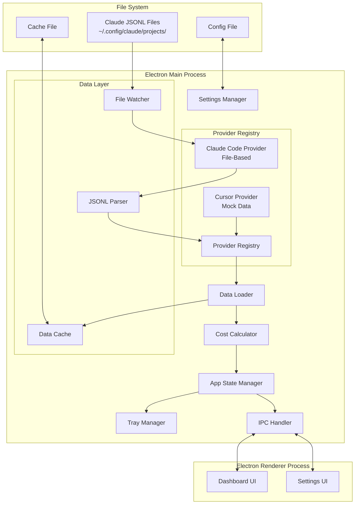
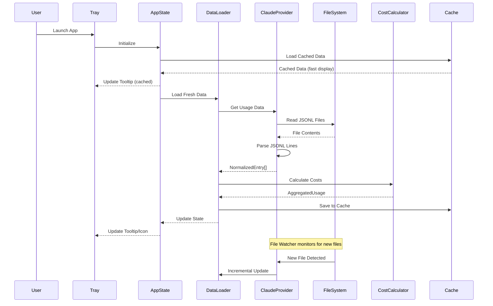

# Cross-Platform Menu Bar Application - Design Document

## Overview

This document describes the architecture and design patterns for building a cross-platform menu bar application using Electron. The design is based on analysis of the existing macOS implementation (`stats-app/CursorBalance`) and adapted for cross-platform support (Windows + macOS).

The application displays AI tool usage statistics (tokens, costs) in the system tray/menu bar, providing quick visibility without interrupting workflow.

**Provider Architecture:**
- **Claude Code**: File-based provider that reads JSONL files from disk
- **Cursor**: Mock data provider (API structure with mock data for development)

## Architecture



### Component Interaction Flow



## Components and Interfaces

### 1. Usage Provider Interface (`src/shared/types.ts`)

The core abstraction for supporting multiple AI tools with different data sources.

```typescript
interface UsageProvider {
  id: string;                              // Unique identifier, e.g., "claude-code"
  name: string;                            // Display name, e.g., "Claude Code"
  type: 'file' | 'api' | 'mock';          // Provider type
  
  // File-based providers
  getDataDirectories(): string[];          // Paths to search for usage data
  parseFile(filePath: string): Promise<NormalizedEntry[]>;
  
  // Common methods
  loadUsageData(): Promise<NormalizedEntry[]>;
  serializeEntry(entry: NormalizedEntry): string;  // For round-trip consistency
  isSupported(): boolean;                  // Check if tool is available
  getPricing(): ModelPricing;              // Provider-specific pricing
}

interface NormalizedEntry {
  timestamp: Date;
  model: string;
  inputTokens: number;
  outputTokens: number;
  cacheCreationTokens: number;
  cacheReadTokens: number;
  totalTokens: number;
  costUSD: number;
  sessionId: string;
  projectId: string;
  provider: string;                        // Provider ID that generated this entry
}
```

### 2. Provider Registry (`src/main/providers/index.ts`)

Manages provider discovery and lifecycle.

```typescript
interface ProviderRegistry {
  registerProvider(provider: UsageProvider): void;
  getProvider(id: string): UsageProvider | undefined;
  getEnabledProviders(): UsageProvider[];
  getAllProviders(): UsageProvider[];
  isProviderEnabled(id: string): boolean;
  setProviderEnabled(id: string, enabled: boolean): void;
}

class ProviderRegistryImpl implements ProviderRegistry {
  private providers: Map<string, UsageProvider> = new Map();
  private enabledProviders: Set<string> = new Set();
  
  constructor() {
    // Register built-in providers
    this.registerProvider(new ClaudeCodeProvider());
    this.registerProvider(new CursorMockProvider());
  }
}
```

### 3. Claude Code Provider (`src/main/providers/claude-code-provider.ts`)

File-based provider for reading Claude Code JSONL files.

```typescript
interface RawClaudeEntry {
  timestamp: string;
  model: string;
  usage: {
    input_tokens: number;
    output_tokens: number;
    cache_creation_input_tokens?: number;
    cache_read_input_tokens?: number;
  };
  costUSD?: number;
  sessionId?: string;
}

class ClaudeCodeProvider implements UsageProvider {
  id = 'claude-code';
  name = 'Claude Code';
  type: 'file' = 'file';
  
  private fileWatcher: FSWatcher | null = null;
  
  // Get platform-specific data directories
  getDataDirectories(): string[] {
    const home = os.homedir();
    if (process.platform === 'darwin') {
      return [
        path.join(home, '.config', 'claude', 'projects'),
        path.join(home, '.claude', 'projects')
      ];
    } else {
      // Windows
      return [
        path.join(home, '.config', 'claude', 'projects'),
        path.join(home, '.claude', 'projects')
      ];
    }
  }
  
  // Parse a single JSONL file
  async parseFile(filePath: string): Promise<NormalizedEntry[]> {
    const content = await fs.readFile(filePath, 'utf-8');
    const lines = content.split('\n').filter(line => line.trim());
    const entries: NormalizedEntry[] = [];
    
    for (const line of lines) {
      try {
        const raw: RawClaudeEntry = JSON.parse(line);
        entries.push(this.normalizeEntry(raw, filePath));
      } catch (e) {
        // Skip malformed lines, log warning
        console.warn(`Skipping malformed line in ${filePath}: ${e}`);
      }
    }
    
    return entries;
  }
  
  // Load all usage data from all directories
  async loadUsageData(): Promise<NormalizedEntry[]> {
    const allEntries: NormalizedEntry[] = [];
    
    for (const dir of this.getDataDirectories()) {
      if (await this.directoryExists(dir)) {
        const files = await this.findJSONLFiles(dir);
        for (const file of files) {
          const entries = await this.parseFile(file);
          allEntries.push(...entries);
        }
      }
    }
    
    return allEntries;
  }
  
  // Normalize raw entry to common format
  private normalizeEntry(raw: RawClaudeEntry, filePath: string): NormalizedEntry {
    const inputTokens = raw.usage.input_tokens || 0;
    const outputTokens = raw.usage.output_tokens || 0;
    const cacheCreationTokens = raw.usage.cache_creation_input_tokens || 0;
    const cacheReadTokens = raw.usage.cache_read_input_tokens || 0;
    
    return {
      timestamp: new Date(raw.timestamp),
      model: raw.model,
      inputTokens,
      outputTokens,
      cacheCreationTokens,
      cacheReadTokens,
      totalTokens: inputTokens + outputTokens + cacheCreationTokens + cacheReadTokens,
      costUSD: raw.costUSD ?? this.calculateCost(raw),
      sessionId: raw.sessionId || path.basename(filePath, '.jsonl'),
      projectId: path.basename(path.dirname(filePath)),
      provider: this.id
    };
  }
  
  // Calculate cost from tokens using pricing
  private calculateCost(raw: RawClaudeEntry): number {
    const pricing = this.getPricing();
    return (
      (raw.usage.input_tokens || 0) * pricing.inputPricePerToken +
      (raw.usage.output_tokens || 0) * pricing.outputPricePerToken +
      (raw.usage.cache_creation_input_tokens || 0) * pricing.cacheCreatePricePerToken +
      (raw.usage.cache_read_input_tokens || 0) * pricing.cacheReadPricePerToken
    );
  }
  
  // Get Claude pricing (per token)
  getPricing(): ModelPricing {
    return {
      inputPricePerToken: 0.000003,      // $3 per 1M tokens
      outputPricePerToken: 0.000015,     // $15 per 1M tokens
      cacheCreatePricePerToken: 0.00000375, // $3.75 per 1M tokens
      cacheReadPricePerToken: 0.0000003  // $0.30 per 1M tokens
    };
  }
  
  // Serialize entry back to original format (for round-trip testing)
  serializeEntry(entry: NormalizedEntry): string {
    const raw: RawClaudeEntry = {
      timestamp: entry.timestamp.toISOString(),
      model: entry.model,
      usage: {
        input_tokens: entry.inputTokens,
        output_tokens: entry.outputTokens,
        cache_creation_input_tokens: entry.cacheCreationTokens,
        cache_read_input_tokens: entry.cacheReadTokens
      },
      costUSD: entry.costUSD,
      sessionId: entry.sessionId
    };
    return JSON.stringify(raw);
  }
  
  isSupported(): boolean {
    return this.getDataDirectories().some(dir => fs.existsSync(dir));
  }
  
  // Watch for file changes
  watchForChanges(callback: () => void): void {
    const dirs = this.getDataDirectories().filter(dir => fs.existsSync(dir));
    if (dirs.length > 0) {
      this.fileWatcher = chokidar.watch(dirs, {
        ignored: /^\./,
        persistent: true,
        ignoreInitial: true
      });
      this.fileWatcher.on('add', callback);
      this.fileWatcher.on('change', callback);
    }
  }
  
  stopWatching(): void {
    this.fileWatcher?.close();
    this.fileWatcher = null;
  }
}
```

### 4. Cursor Mock Provider (`src/main/providers/cursor-mock-provider.ts`)

Mock data provider for Cursor (development purposes).

```typescript
class CursorMockProvider implements UsageProvider {
  id = 'cursor';
  name = 'Cursor';
  type: 'mock' = 'mock';
  
  private mockDataType: MockDataType = 'pro';
  
  getDataDirectories(): string[] {
    return []; // Mock provider doesn't read files
  }
  
  async parseFile(filePath: string): Promise<NormalizedEntry[]> {
    return []; // Not applicable for mock provider
  }
  
  async loadUsageData(): Promise<NormalizedEntry[]> {
    // Return mock data based on selected type
    return this.generateMockData(this.mockDataType);
  }
  
  setMockDataType(type: MockDataType): void {
    this.mockDataType = type;
  }
  
  private generateMockData(type: MockDataType): NormalizedEntry[] {
    const now = new Date();
    const startOfMonth = new Date(now.getFullYear(), now.getMonth(), 1);
    
    // Generate mock entries for the current month
    const entries: NormalizedEntry[] = [];
    const mockConfig = MOCK_DATA_CONFIGS[type];
    
    for (let i = 0; i < mockConfig.entryCount; i++) {
      entries.push({
        timestamp: new Date(startOfMonth.getTime() + i * 3600000),
        model: mockConfig.model,
        inputTokens: mockConfig.avgInputTokens,
        outputTokens: mockConfig.avgOutputTokens,
        cacheCreationTokens: 0,
        cacheReadTokens: 0,
        totalTokens: mockConfig.avgInputTokens + mockConfig.avgOutputTokens,
        costUSD: mockConfig.costPerEntry,
        sessionId: `mock-session-${i}`,
        projectId: 'mock-project',
        provider: this.id
      });
    }
    
    return entries;
  }
  
  serializeEntry(entry: NormalizedEntry): string {
    return JSON.stringify(entry);
  }
  
  isSupported(): boolean {
    return true; // Mock is always available
  }
  
  getPricing(): ModelPricing {
    return {
      inputPricePerToken: 0.000001,
      outputPricePerToken: 0.000002,
      cacheCreatePricePerToken: 0,
      cacheReadPricePerToken: 0
    };
  }
}

type MockDataType = 'hobby' | 'pro' | 'proPlus' | 'ultra' | 'teams' | 'enterprise';

const MOCK_DATA_CONFIGS: Record<MockDataType, MockConfig> = {
  hobby: { entryCount: 50, avgInputTokens: 500, avgOutputTokens: 200, costPerEntry: 0.001, model: 'gpt-4' },
  pro: { entryCount: 200, avgInputTokens: 1000, avgOutputTokens: 500, costPerEntry: 0.003, model: 'gpt-4' },
  proPlus: { entryCount: 500, avgInputTokens: 1500, avgOutputTokens: 800, costPerEntry: 0.005, model: 'gpt-4' },
  ultra: { entryCount: 1000, avgInputTokens: 2000, avgOutputTokens: 1000, costPerEntry: 0.008, model: 'gpt-4' },
  teams: { entryCount: 300, avgInputTokens: 1200, avgOutputTokens: 600, costPerEntry: 0.004, model: 'gpt-4' },
  enterprise: { entryCount: 800, avgInputTokens: 1800, avgOutputTokens: 900, costPerEntry: 0.006, model: 'gpt-4' }
};
```

### 5. Data Loader Module (`src/main/data-loader.ts`)

Provider-agnostic orchestrator for loading and aggregating data.

```typescript
interface DataLoaderConfig {
  refreshInterval: number;  // Milliseconds between auto-refresh
}

interface DataLoader {
  loadAllData(): Promise<NormalizedEntry[]>;
  loadDataByProvider(providerId: string): Promise<NormalizedEntry[]>;
  loadDailyData(date: Date): Promise<NormalizedEntry[]>;
  watchForChanges(callback: () => void): void;
  stopWatching(): void;
}

class DataLoaderImpl implements DataLoader {
  private registry: ProviderRegistry;
  private cache: DataCache;
  
  async loadAllData(): Promise<NormalizedEntry[]> {
    const allEntries: NormalizedEntry[] = [];
    
    for (const provider of this.registry.getEnabledProviders()) {
      try {
        const entries = await provider.loadUsageData();
        allEntries.push(...entries);
      } catch (e) {
        console.error(`Failed to load data from ${provider.name}: ${e}`);
        // Continue with other providers
      }
    }
    
    // Sort by timestamp descending (most recent first)
    return allEntries.sort((a, b) => b.timestamp.getTime() - a.timestamp.getTime());
  }
  
  async loadDailyData(date: Date): Promise<NormalizedEntry[]> {
    const allData = await this.loadAllData();
    const startOfDay = new Date(date.getFullYear(), date.getMonth(), date.getDate());
    const endOfDay = new Date(startOfDay.getTime() + 24 * 60 * 60 * 1000);
    
    return allData.filter(entry => 
      entry.timestamp >= startOfDay && entry.timestamp < endOfDay
    );
  }
}
```

### 6. Cost Calculator Module (`src/main/cost-calculator.ts`)

Calculates costs from token counts using provider-specific pricing.

```typescript
interface ModelPricing {
  inputPricePerToken: number;
  outputPricePerToken: number;
  cacheCreatePricePerToken: number;
  cacheReadPricePerToken: number;
}

interface CostCalculator {
  calculateEntryCost(entry: NormalizedEntry, pricing: ModelPricing): number;
  aggregateCosts(entries: NormalizedEntry[]): AggregatedUsage;
  aggregateByProvider(entries: NormalizedEntry[]): Map<string, AggregatedUsage>;
  formatCostUSD(cost: number): string;
}

interface AggregatedUsage {
  inputTokens: number;
  outputTokens: number;
  cacheCreationTokens: number;
  cacheReadTokens: number;
  totalTokens: number;
  totalCostUSD: number;
  entryCount: number;
  modelBreakdown: Map<string, ModelUsage>;
  providerBreakdown: Map<string, ProviderUsage>;
}

interface ProviderUsage {
  providerId: string;
  providerName: string;
  inputTokens: number;
  outputTokens: number;
  cacheCreationTokens: number;
  cacheReadTokens: number;
  totalTokens: number;
  costUSD: number;
  entryCount: number;
}
```

### 7. App State Manager (`src/main/app-state.ts`)

Centralized state management.

```typescript
interface AppState {
  entries: NormalizedEntry[];
  aggregatedUsage: AggregatedUsage | null;
  dailyUsage: AggregatedUsage | null;
  status: AppStatus;
  settings: AppSettings;
  isHighUsage: boolean;
}

enum AppStatus {
  Loading = 'loading',
  Success = 'success',
  Stale = 'stale',
  Error = 'error'
}

class AppStateManager {
  private state: AppState;
  private dataLoader: DataLoader;
  private costCalculator: CostCalculator;
  private settingsManager: SettingsManager;
  private refreshTimer: NodeJS.Timeout | null = null;
  
  async refreshData(): Promise<void> {
    try {
      const entries = await this.dataLoader.loadAllData();
      const aggregated = this.costCalculator.aggregateCosts(entries);
      const dailyEntries = await this.dataLoader.loadDailyData(new Date());
      const daily = this.costCalculator.aggregateCosts(dailyEntries);
      
      this.state = {
        ...this.state,
        entries,
        aggregatedUsage: aggregated,
        dailyUsage: daily,
        status: AppStatus.Success,
        isHighUsage: this.checkHighUsage(daily)
      };
      
      this.emit('stateChanged', this.state);
    } catch (e) {
      this.state.status = AppStatus.Error;
      this.emit('error', e);
    }
  }
  
  private checkHighUsage(daily: AggregatedUsage): boolean {
    if (!this.state.settings.usageAlertEnabled) return false;
    const threshold = this.state.settings.usageAlertThreshold;
    return daily.totalCostUSD > threshold;
  }
}
```

### 8. Tray Manager (`src/main/tray-manager.ts`)

Manages system tray icon, tooltip, and context menu.

```typescript
class TrayManager {
  private tray: Tray | null = null;
  private appState: AppStateManager;
  
  initialize(): void {
    this.tray = new Tray(this.getNormalIcon());
    this.tray.setContextMenu(this.buildContextMenu());
    this.updateTooltip();
    
    this.tray.on('double-click', () => {
      this.openDashboard();
    });
  }
  
  updateTooltip(): void {
    const daily = this.appState.getDailyUsage();
    if (daily) {
      const tooltip = `AI Usage Monitor\n` +
        `Today: ${this.formatCost(daily.totalCostUSD)}\n` +
        `Tokens: ${daily.totalTokens.toLocaleString()}`;
      this.tray?.setToolTip(tooltip);
    }
  }
  
  setAlertState(isAlert: boolean): void {
    const icon = isAlert ? this.getAlertIcon() : this.getNormalIcon();
    this.tray?.setImage(icon);
  }
  
  private buildContextMenu(): Menu {
    return Menu.buildFromTemplate([
      { label: 'Open Dashboard', click: () => this.openDashboard() },
      { type: 'separator' },
      { label: 'Refresh', click: () => this.appState.refreshData() },
      { label: 'Settings...', click: () => this.openSettings() },
      { type: 'separator' },
      { label: 'Quit', click: () => app.quit() }
    ]);
  }
}
```

## Data Models

### NormalizedEntry

Common format for all provider data.

```typescript
interface NormalizedEntry {
  timestamp: Date;
  model: string;
  inputTokens: number;
  outputTokens: number;
  cacheCreationTokens: number;
  cacheReadTokens: number;
  totalTokens: number;
  costUSD: number;
  sessionId: string;
  projectId: string;
  provider: string;
}
```

### AppSettings

```typescript
interface AppSettings {
  refreshIntervalSeconds: number;  // 60-3600
  displayFormat: 'cost' | 'tokens';
  usageAlertEnabled: boolean;
  usageAlertThreshold: number;     // USD
  launchAtLogin: boolean;
  enabledProviders: string[];
  customDataDirectories: string[];
}
```

## Error Handling

### Error Types

```typescript
enum AppError {
  FileSystemError = 'file_system_error',
  ParseError = 'parse_error',
  CacheError = 'cache_error',
  ProviderError = 'provider_error'
}

enum FileSystemError {
  DirectoryNotFound = 'directory_not_found',
  PermissionDenied = 'permission_denied',
  FileNotReadable = 'file_not_readable'
}

enum ParseError {
  InvalidJSON = 'invalid_json',
  MissingRequiredField = 'missing_required_field',
  InvalidTimestamp = 'invalid_timestamp',
  NegativeTokenCount = 'negative_token_count'
}
```

### Error Recovery Strategy

| Error Type | Recovery Action |
|------------|-----------------|
| Directory not found | Log warning, continue with other directories |
| Permission denied | Log error, suggest checking permissions |
| Malformed JSONL line | Skip line, log warning, continue processing |
| Provider load failure | Log error, disable provider, continue with others |
| Cache corruption | Clear cache, reprocess source files |

## Correctness Properties

Properties that must hold true for all valid executions:

### Property 1: Data Round-Trip Consistency
*For any* valid usage entry, parsing the entry and then serializing it back should produce an equivalent entry when parsed again.

### Property 2: Token Count Non-Negativity
*For any* parsed usage entry, all token count fields must be non-negative integers.

### Property 3: Cost Calculation Formula
*For any* usage entry without pre-calculated cost, the calculated cost should equal:
`(inputTokens * inputPrice) + (outputTokens * outputPrice) + (cacheCreateTokens * cacheCreatePrice) + (cacheReadTokens * cacheReadPrice)`

### Property 4: Pre-calculated Cost Preference
*For any* usage entry with a costUSD field, the system should use that value instead of calculating.

### Property 5: Time Period Filtering
*For any* time period selection and dataset, filtered results contain only entries within that period.

### Property 6: Provider Tagging Consistency
*For any* normalized entry, the provider field must match the ID of the provider that parsed it.

### Property 7: Cost Aggregation Correctness
*For any* set of entries, aggregated total cost equals the sum of individual entry costs.

### Property 8: Provider Isolation on Failure
*For any* provider that fails to load, other providers continue to function normally.

## Testing Strategy

### Unit Tests
- JSONL parsing with various formats
- Cost calculation accuracy
- Token validation (non-negative)
- Round-trip serialization

### Integration Tests
- File watching and incremental updates
- Multi-directory aggregation
- Provider registry behavior
- Cache persistence

### Property-Based Tests (fast-check)
- Round-trip consistency
- Token non-negativity
- Cost formula correctness
- Time filtering correctness

## Platform-Specific Considerations

### macOS
- Data directories: `~/.config/claude/`, `~/.claude/`
- App data: `~/Library/Application Support/AIUsageMonitor/`
- File watching: Use `chokidar` or native `fs.watch`

### Windows
- Data directories: `%USERPROFILE%\.config\claude\`, `%USERPROFILE%\.claude\`
- App data: `%APPDATA%\AIUsageMonitor\`
- File watching: Same as macOS with `chokidar`

## References

- macOS Implementation: `stats-app/CursorBalance/`
- Original Design: `docs/design.md`
- Original Requirements: `docs/requirements.md`
- Electron Documentation: https://www.electronjs.org/docs
- chokidar: https://github.com/paulmillr/chokidar
